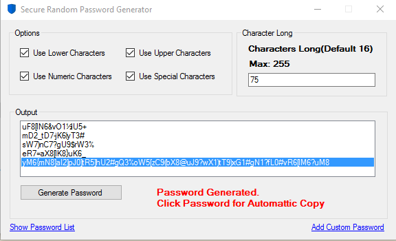
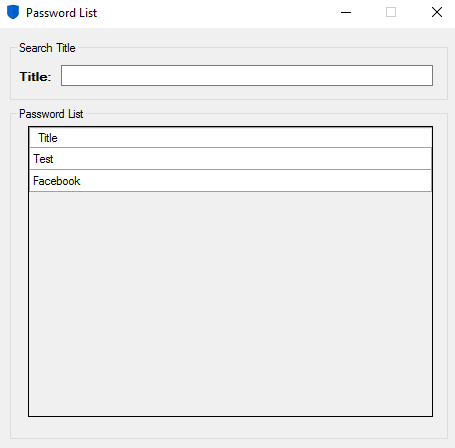
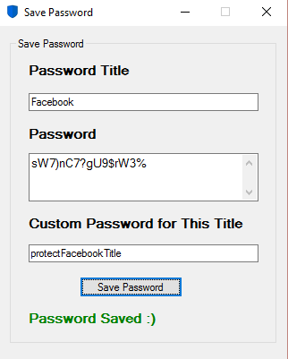
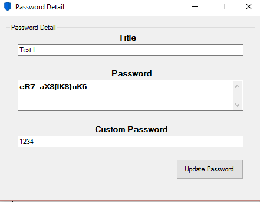
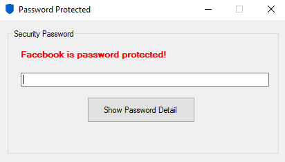
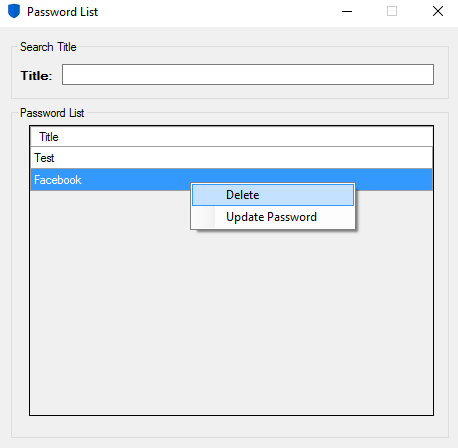

# SecurePasswordGenerator

Secure Random Password Generator &amp; Password Manager

Keyboard shortcut supported :) [#keyboard-shortcuts--not-completed-](See the shortcut list)

# Screenshots

**Main Screen**

**Password List**

**Password Saving**

**Password Update**

**Password Protected List**

**Right Click on Password List**

# Keyboard Shortcuts ( Not Completed )

CTRL + G = Generate random password

ALT + L = Use Lower Characters

ALT + U = Use Upper Characters

ALT + N = Use Numeric Characters

ALT + S = Use Special Characters

CTRL + S = Show Password List

CTRL + P = Add Password

CTRL + C = Copy Selected Password ( or click password in main form)

CTRL + H = Help

CTRL + E = Exit

Enter = Update data (not completed Enter key)

Also you can use up-down arrow in main form's listbox :)

# Note & Features

Default password long = 16 (for empty textBox)

Double Click Listed Password for Saving

Password protected title

**Status: Dev**

# Library

SQLite
